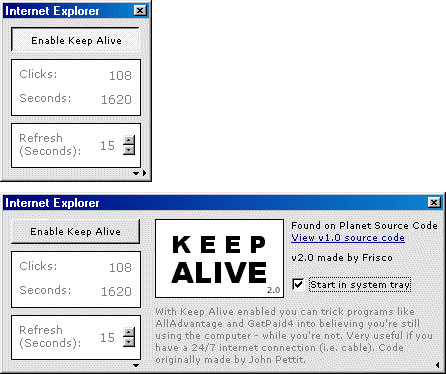



## Keep Alive 2

### Description

I saw the Keep AllAdvantage Active-code today, and thought I'd improve it abit. So I added a new - smaller - interface and a tray icon. The rest of the code is mostly the same as the original. If you had use for the first version, you'd probably want this one as well. Just think of it as an upgrade..
 
### More Info
 
AllAdvantage is stupid. It only pays you money when you use a window with the words "Internet Explorer" in the title - and you have to click the window every now and then. So what the Keep Alive does is that it clicks itself, which have the "Internet Explorer" as the title. Voila!

(Note: I haven't tested the program with AllAdvantage or GetPaid4)

You shouldn't use the pc when the program is running. The whole idea behind the program is to make AllAdvantage or GetPaid4 believe you're sitting there when you're away.

             |
---                |---
**Submitted On**   |2000-05-06 20:13:46
**By**             |[Stai](https://github.com/Planet-Source-Code/PSCIndex/blob/master/ByAuthor/stai.md)
**Level**          |Intermediate
**User Rating**    |5.0 (10 globes from 2 users)
**Compatibility**  |VB 5\.0, VB 6\.0
**Category**       |[Complete Applications](https://github.com/Planet-Source-Code/PSCIndex/blob/master/ByCategory/complete-applications__1-27.md)
**World**          |[Visual Basic](https://github.com/Planet-Source-Code/PSCIndex/blob/master/ByWorld/visual-basic.md)
**Archive File**   |[CODE\_UPLOAD5544562000\.zip](https://github.com/Planet-Source-Code/stai-keep-alive-2__1-7902/archive/master.zip)

